<picture>
  <source media="(prefers-color-scheme: dark)" srcset="./assets/hero-dark.svg">
  <source media="(prefers-color-scheme: light)" srcset="./assets/hero-light.svg">
  
</picture>

 

<picture>
  <source media="(prefers-color-scheme: dark)" srcset="./assets/divider-dark.svg">
  <source media="(prefers-color-scheme: light)" srcset="./assets/divider-light.svg">
  
</picture>

## 👋 About

I'm a **Solutions Engineer**. I sit where the product meets the customer — designing, integrating,
and de-risking complex technical solutions so they actually make it to production.

Most of my time goes into **developer platforms, automation, and AI-assisted engineering**. The
repos below are where I try things out.

<picture>
  <source media="(prefers-color-scheme: dark)" srcset="./assets/divider-dark.svg">
  <source media="(prefers-color-scheme: light)" srcset="./assets/divider-light.svg">
  
</picture>

## 🛠️ Skills &amp; Technologies

**Languages**

**Testing &amp; Automation**

**Cloud, CI/CD &amp; Infrastructure**

**Data**

**Platform &amp; Ways of Working**

<picture>
  <source media="(prefers-color-scheme: dark)" srcset="./assets/divider-dark.svg">
  <source media="(prefers-color-scheme: light)" srcset="./assets/divider-light.svg">
  
</picture>

## 🚀 Featured Work

<table>
<tr>
<td width="50%" valign="top">

### 🎬 [copilot-video-gen-plugin](https://github.com/abhi-singhs/copilot-video-gen-plugin)

Turns a natural-language prompt into a runnable animation project. Picks the right tool for the
job across **Motion, GSAP, Three.js, Motion Canvas, Remotion, Manim, and p5.js**, then scaffolds a
working starter and renders it to mp4.

`Shell` &nbsp;·&nbsp; `Copilot CLI plugin`

</td>
<td width="50%" valign="top">

### ☎️ [agent-voice-app](https://github.com/abhi-singhs/agent-voice-app)

A desktop phone for your coding agent — it calls *you* over MCP for a natural spoken
back-and-forth. Voice runs fully on-device by default (Parakeet STT + Kokoro TTS via sherpa-onnx).

`Rust` &nbsp;·&nbsp; `Tauri v2` &nbsp;·&nbsp; `React` &nbsp;·&nbsp; `MCP`

</td>
</tr>
<tr>
<td width="50%" valign="top">

### 💾 [copilot-os-doom-demo](https://github.com/abhi-singhs/copilot-os-doom-demo)

A from-scratch x86_64 operating system that boots in QEMU and runs Freedoom. Ring-0 kernel, ring-3
userspace with a custom libc and shell, FAT16, SB16 audio, syscall ABI, and an ELF loader.

`C` &nbsp;·&nbsp; `Assembly` &nbsp;·&nbsp; `OS internals`

</td>
<td width="50%" valign="top">

### 🔁 [copilot-cli-claude-code-compat](https://github.com/abhi-singhs/copilot-cli-claude-code-compat)

A compatibility layer that lets you drive GitHub Copilot CLI with familiar Claude Code syntax —
flag-translation wrapper, reference skill, and config-sync for macOS, Linux, and Windows.

`Python` &nbsp;·&nbsp; `Developer tooling`

</td>
</tr>
<tr>
<td width="50%" valign="top">

### 📊 [actions-runner-analytics](https://github.com/abhi-singhs/actions-runner-analytics)

Analyses GitHub Actions runner usage across an organisation — interactive HTML dashboard, advanced
filtering, cost categorisation, and automated reporting to optimise CI/CD spend.

`Python` &nbsp;·&nbsp; `FinOps` &nbsp;·&nbsp; `CI/CD`

</td>
<td width="50%" valign="top">

### 🪙 [copilot-token-meter](https://github.com/abhi-singhs/copilot-token-meter)

Live token and cost meter for GitHub Copilot CLI — title-bar footer, a `/tokens` slash command, and
a companion CLI so you always know what a session is costing.

`JavaScript` &nbsp;·&nbsp; `Observability`

</td>
</tr>
</table>

<a href="https://github.com/abhi-singhs?tab=repositories"><b>Browse all repositories →</b></a>

<picture>
  <source media="(prefers-color-scheme: dark)" srcset="./assets/footer-dark.svg">
  <source media="(prefers-color-scheme: light)" srcset="./assets/footer-light.svg">
  
</picture>

Built with care · <a href="https://abhisingh.in">abhisingh.in</a>

